<!-- ebinraj2007-cmd/ebinraj2007-cmd · Profile README -->
<!-- All animation is self-hosted in /assets — nothing depends on an outside service. -->

> *I build things that actually run, not just demos.*

I'm studying Information Systems Management, and I learn by building. Most of what I know came
from shipping the projects below, breaking them, and fixing them. I made `SENTRY` at the
Dubai Customs × University of Dubai hackathon, I'm Cisco-certified in **AI**, **Cybersecurity**
and **IT**, and right now I'm building `Barjeel` — a QR scam scanner that runs entirely offline
on your phone.

**I'm looking for an AI / automation internship** — my inbox is always open.

### `what I use`

### `things I've built`

| | |
|---|---|
| **🏗️ [Barjeel](https://github.com/ebinraj2007-cmd/barjeel)** · [live app](https://ebinraj2007-cmd.github.io/barjeel/) Scammers here stick fake QR codes over the real ones on parking meters. Barjeel tells you where a code *actually* leads before anything opens — lookalike Cyrillic domains, punycode, typosquats, subdomain tricks. Also spots physical sticker overlays — `3/3` caught with `0` false alarms on a labelled photo set. `100 tests`, zero dependencies. Never talks to a server, so it works underground with no signal. | **🛡️ [SENTRY](https://github.com/ebinraj2007-cmd/sentry)** · [live demo](https://ebinraj2007-cmd.github.io/sentry/) Scores cargo risk `0–100` from scanner images, customs data and watchlists. What took 20 minutes takes seconds. Built at the Dubai Customs × University of Dubai hackathon. |
| **💬 [NoorDesk](https://github.com/ebinraj2007-cmd/noordesk)** An AI front desk that reads a message in any of `5 languages`, works out the tone and urgency, and writes back in the customer's own language. Runs offline. Live updates over WebSocket with polling kept as a fallback — both paths in the codebase on purpose. `65 tests`, Dockerised. | **🔒 [AccessAudit](https://github.com/ebinraj2007-cmd/accessaudit)** Finds the accounts people still have after they've left, and lets you shut them off in one click — with a full audit trail that survives a container being replaced. Dockerised, non-root. |
| **📈 [NMS](https://github.com/ebinraj2007-cmd/nms-ai-monitoring)** Network monitoring that heals itself, and predicts a disk failure before the drive actually dies. | |

Every one of these runs, has tests, and has been through a security pass. 210 tests across five repositories.

Cisco — Modern AI · Cybersecurity · IT Essentials  |  IBM SkillsBuild — Cybersecurity Fundamentals  |  Dubai Future Foundation — One Million Prompters

**[Portfolio](https://ebinraj2007-cmd.github.io)** · **[LinkedIn](https://linkedin.com/in/ebin-raj-3b3243366)** · `ebinraj2007@gmail.com`

<!--
  SNAKE ANIMATION — currently off so nothing shows as a broken image.
  To switch it on:
    1. Actions tab -> "Generate snake animation" -> Run workflow (one time)
    2. Wait ~30s for it to finish
    3. Delete this comment wrapper so the <picture> block below goes live
<picture>
  <source media="(prefers-color-scheme: dark)" srcset="https://raw.githubusercontent.com/ebinraj2007-cmd/ebinraj2007-cmd/output/github-snake-dark.svg" />
  <source media="(prefers-color-scheme: light)" srcset="https://raw.githubusercontent.com/ebinraj2007-cmd/ebinraj2007-cmd/output/github-snake.svg" />
  
</picture>
-->
